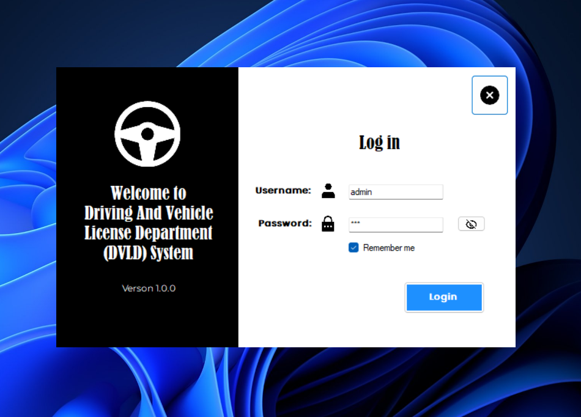
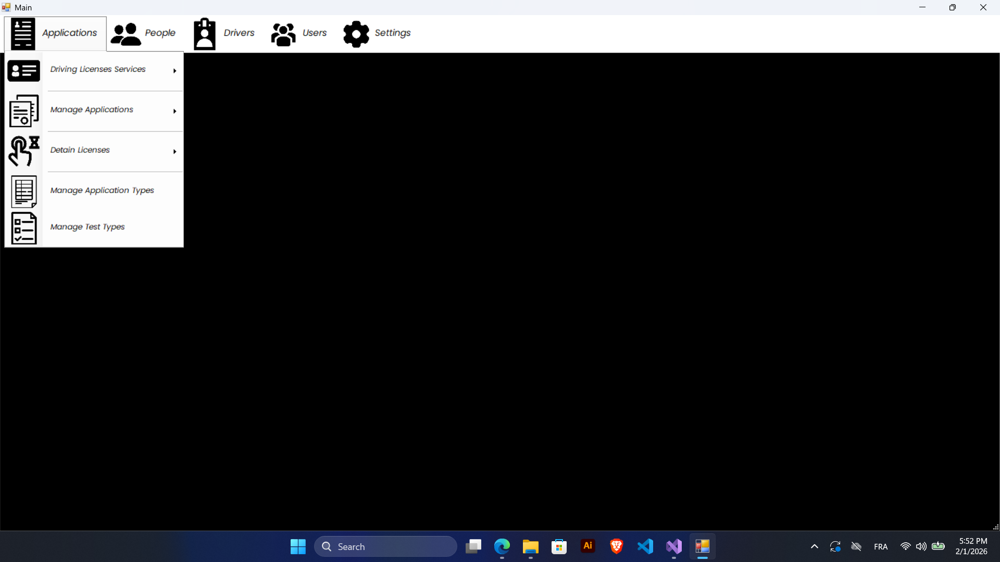
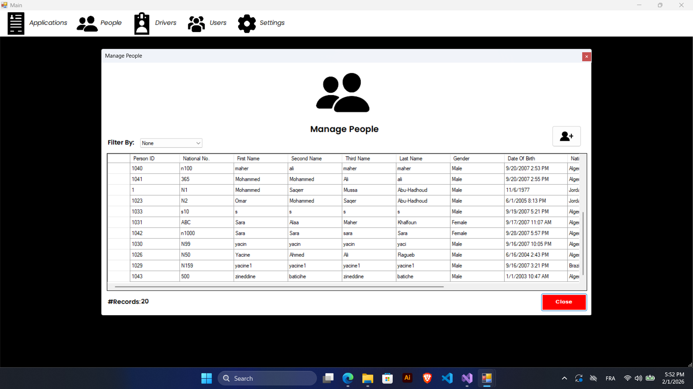
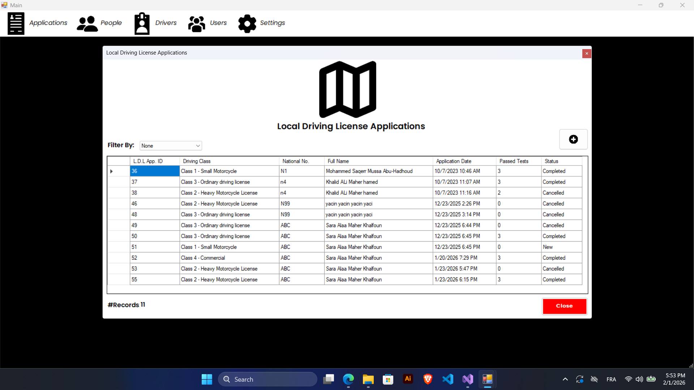
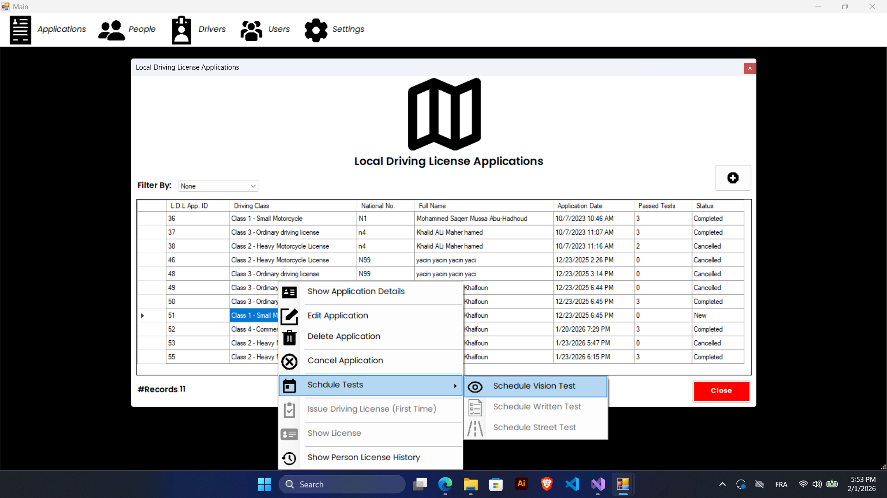
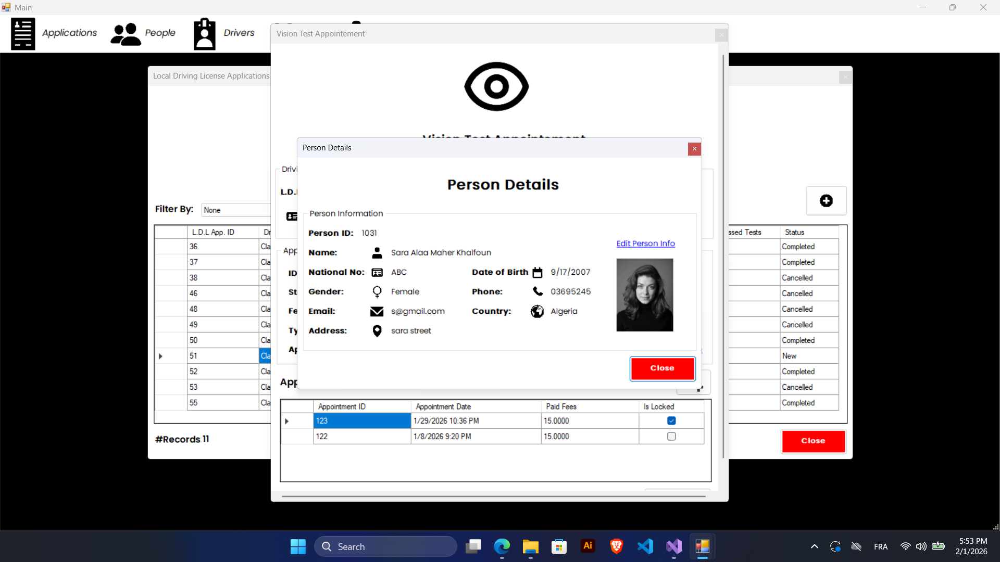
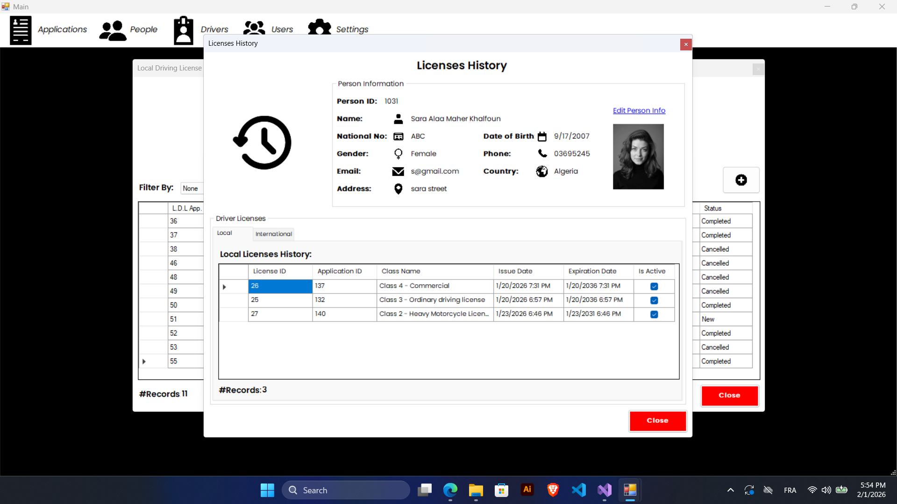
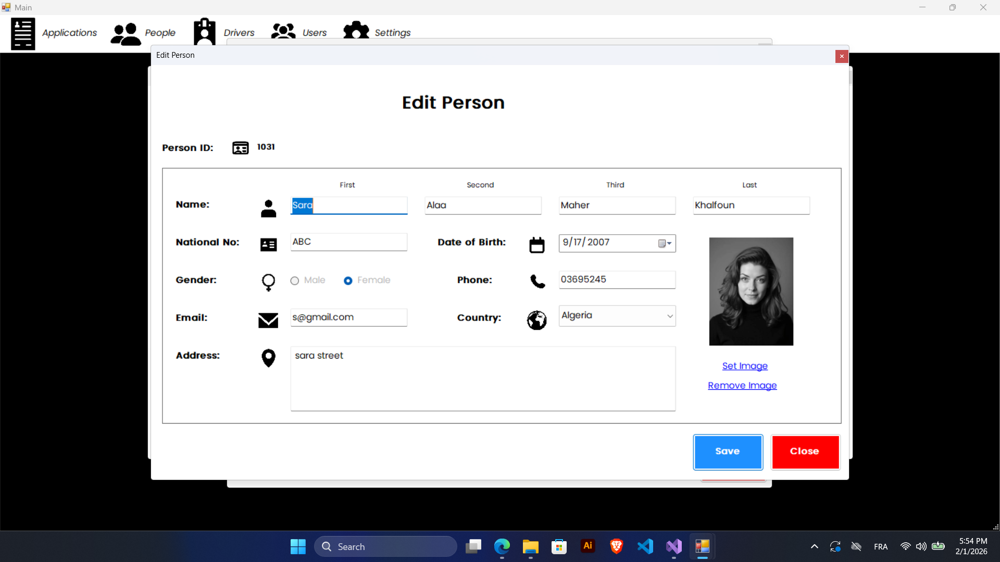

# 🚗 DVLD – Driving & Vehicle License Management System

A desktop-based management system for the **Driving & Vehicle License Department (DVLD)** built with **C# and .NET Framework (WinForms)**.

This system digitalizes the entire driver licensing workflow, from applications and testing to issuance and renewals.

---

## ✨ Key Features

### 📄 License Services
- First-time license issuance
- License renewal
- Re-test requests
- Lost/Damaged license replacement
- License hold & release
- International driving license

### 👤 Applicant Management
- Centralized citizen records
- Search by National ID
- Personal details & photo storage
- No duplicate profiles
- Full request history per applicant

### 🧪 Testing Workflow
- Vision test management
- Theory test recording
- Practical driving test scheduling
- Re-attempt support for failed tests
- Automatic eligibility validation

### 🪪 License Management
- Multiple license classes
- Age & eligibility rules enforcement
- Expiration tracking
- Status control (Active / Held / Expired)
- Printable licenses

### 🛠️ Administration
- Role-based user accounts
- Permissions management
- Request filtering & tracking
- Configurable fees
- Full activity logging & auditing

---

## 🖥️ Tech Stack

| Layer | Technology |
|-------|------------|
| Language | C# |
| Framework | .NET Framework |
| UI | Windows Forms (WinForms) |
| Database | SQL Server |
| Architecture | Layered (Three-tier architecture) / OOP Design |

---

## 📸 Some screenshots

---

## 🎯 Use Cases
- Government licensing departments
- Driving schools
- Training centers
- Administrative staff

---

## 👨‍💻 Author
- Yacine Ragueb  
- LinkedIn: [@yacineragueb](https://www.linkedin.com/in/yacine-ragueb-8033a9302/)
- My Website: [yacineragueb](https://yacineragueb.vercel.app/)
- Email: yacineddd32@gmail.com

